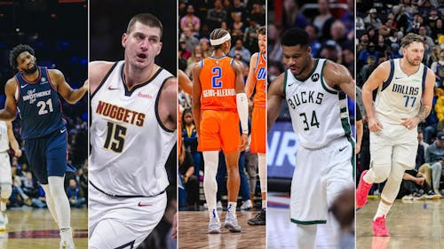
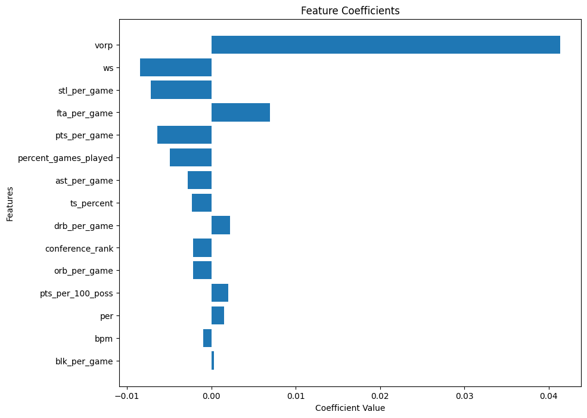
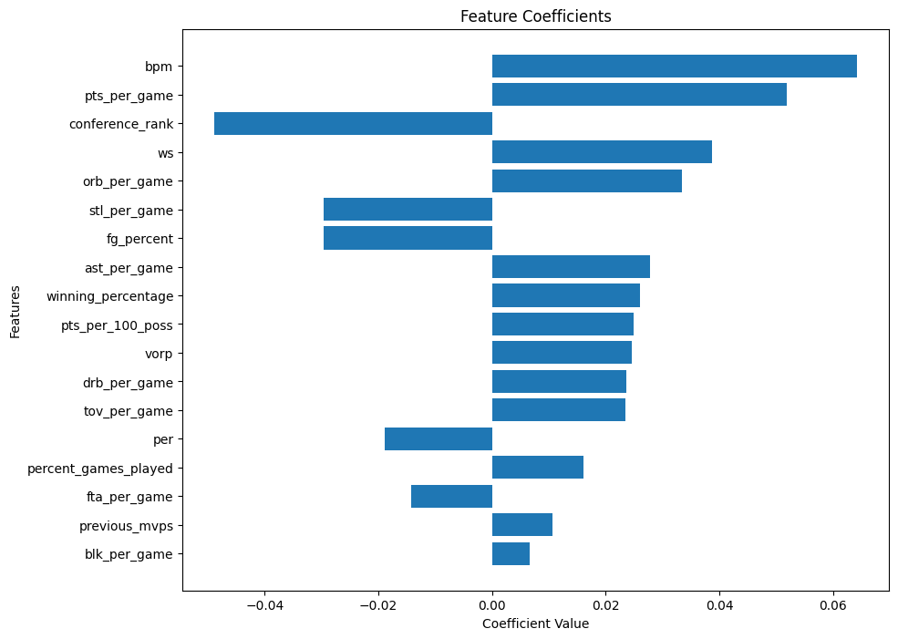
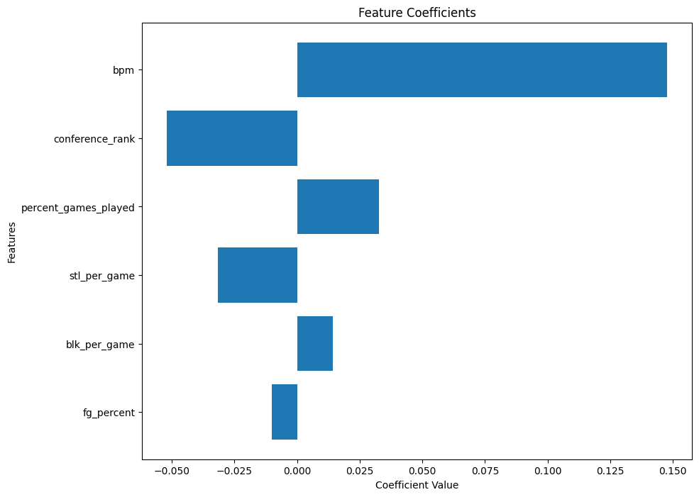

# NBA MVP Prediction Project

## Technologies Used
- Python
- scikit-learn
- pandas
- numpy
- matplotlib/seaborn (for visualization)

## 2024 MVP Winner According to Experiments
The 2024 NBA MVP, as predicted by our linear regression model based on players' statistical performance, is Nikola Jokic (Predicted March 31st, 2024).

## Experiment Details

Refer to nba_mvp_generator.ipynb for code and detailed experiment results including graphs.

### Overview
This project aims to predict the NBA Most Valuable Player (MVP) using a linear regression model implemented with scikit-learn. The model takes into account various player statistics as features to make its predictions. The MVP vote share in predicted and the player with the highest vote share per season is awarded MVP by the model.

In total 3 separate experiments were conducted, which all found Nikola Jokic to be the 2024 NBA MVP. In the first experiment the entire league was used as a data set to train the model. In the second experiment only past recipients of MVP votes were used as data to train the model. In the third experiment features were iteratively selected to produce the best results.

### Data
The model was trained on data from 1976-2010 and tested against data from 2010-2023. Statistics such as box stats, advanced stats, winning percentage, and others were used as features in the linear regression. The data_creation.ipynb file contains the code used to compile the relevant stats and write them to data_for_predictions.csv.

Data set curtesy of SUMOTRO DATTA: https://www.kaggle.com/datasets/sumitrodatta/nba-aba-baa-stats

### Feature Engineering
Certain features such as winning percentage and past MVPs were not contained in the Kaggle dataset and had to be created (refer to data_creation.ipynb to see the code).

In experiment 3 past MVPs was squared in an attempt to have the model capture voters fatigue. This tweak was successful and allowed the linear regression to correctly predict Derrick Rose as the 2010-2011 MVP.

### Model Training
The model used was a scikit-learn linear regression. Training and test data was split at 2010 to allow for a large training sample and the ability to validate past MVP predictions. The regression was normalized to account for the different magnitudes of stats.

### Results
#### Experiment 1
Experiment 1 used the entire league as data in training. As such the model distingushes MVP level players from normal NBA players.
##### Predicted MVPs
    Predicted                season
    LeBron James             2011
    LeBron James             2012
    LeBron James             2013
    Kevin Durant             2014
    James Harden             2015
    Stephen Curry            2016
    Russell Westbrook        2017
    LeBron James             2018
    James Harden             2019
    Giannis Antetokounmpo    2020
    Nikola Jokić             2021
    Nikola Jokić             2022
    Nikola Jokić             2023
    Nikola Jokić             2024

This model predicted 8/13 MVPs correctly from 2010-2023. It predicts Jokic for 2024 MVP.
##### Regression Coefficients

Value over replacement player is by far the most impactful statistic in differentiating MVPs from the league as a whole.
#### Experiment 2
Experiment 2 uses only past MVP vote recipients as the data. As such it distinguishes MVP winners from other NBA candidates.
##### Predicted MVPs
    Predicted                season
    LeBron James             2011
    LeBron James             2012
    LeBron James             2013
    Kevin Durant             2014
    James Harden             2015
    Stephen Curry            2016
    Russell Westbrook        2017
    James Harden             2018
    James Harden             2019
    Giannis Antetokounmpo    2020
    Nikola Jokić             2021
    Nikola Jokić             2022
    Nikola Jokić             2023
    Nikola Jokić             2024

This model predicted 9/13 MVPs correctly from 2010-2023. It predicts Jokic for 2024 MVP.
##### Regression Coefficients

Box Plus Minus is the most impactful statistic to differentiate MVP winners from other MVP candidates according to the regression.
#### Experiment 3
Experiment 3 builds on top of experiment 2 but uses preproccessed and iteratively selected features to increase the accuracy of the model.
##### Predicted MVPs
    Predicted                season
    Derrick Rose             2011
    LeBron James             2012
    LeBron James             2013
    Kevin Durant             2014
    Stephen Curry            2015
    Stephen Curry            2016
    Russell Westbrook        2017
    James Harden             2018
    Giannis Antetokounmpo    2019
    Giannis Antetokounmpo    2020
    Nikola Jokić             2021
    Nikola Jokić             2022
    Nikola Jokić             2023
    Nikola Jokić             2024

This model predicted 12/13 MVPs correctly from 2010-2023. It predicts Jokic for 2024 MVP.
##### Regression Coefficients

